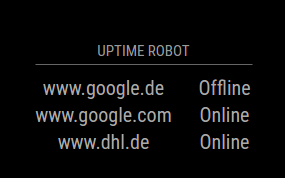
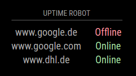
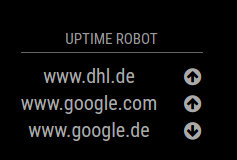
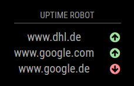

# MMM-uptimerobot [](https://github.com/mrVragec/MMM-uptimerobot/raw/master/LICENSE) [](https://travis-ci.org/mrVragec/MMM-uptimerobot) [](https://snyk.io/test/github/mrvragec/mmm-uptimerobot) [](https://codeclimate.com/github/mrVragec/MMM-uptimerobot)

MagicMirror² to get uptime data from http://uptimerobot.com API. 

## Examples
   


## Instalation
1. Clone this repository in your MagicMirror installation under modules.
2. Rename plugin foler from 'MMM-uptimerobot' to 'uptimerobot'
3. Add configuration to config.js

## Using the module

To use this module, add the following configuration block to the modules array in the `config/config.js` file:
```js
var config = {
    modules: [
        {
            module: 'uptimerobot',
            config: {
                // See below for configurable options
            }
        }
    ]
}
```
## Requirements

No special requirements or dependencies. 

## Configuration options

| Option           | Description
|----------------- |-----------
| `api_key`        | *Required* API Key from https://uptimerobot.com. API Key is available under 'My Settings' in 'API Setting' section (click on Show/hide it and if not available generate new one).
| `useIcons`       | *Optional* Flag to use icons (true) or text (false) values for status of monitor. <br><br>**Type:** `boolean` <br>Default: false - text values.
| `useColors`      | *Optional* Flag to use colors (true) for status of monitor<br><br>**Type:** `boolean` <br>Default: false - without colors.
| `maximumEntries` | *Optional* Number of items (monitors) to shown. <br><br>**Type:** `int` <br>Default: 10 items.
| `statuses`       | *Optional* Filter out monitor by status (0 - paused; 1 - not checked yet; 2 - up; 8 - seems down; 9 - down<br><br>**Type:** `String` <br>Default: 0-1-2-8-9 (show monitors with all statuses).
